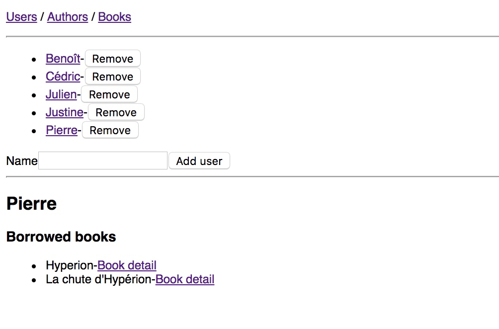
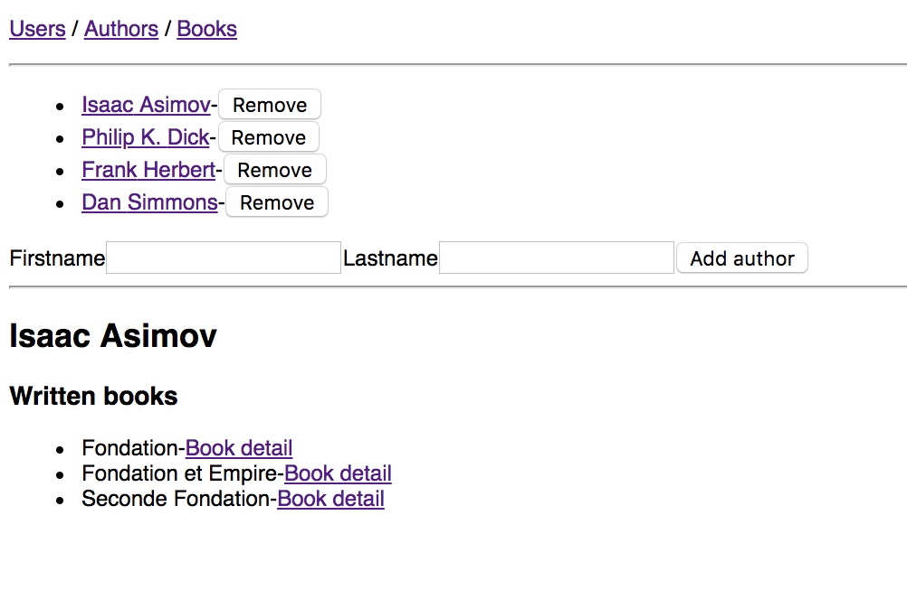
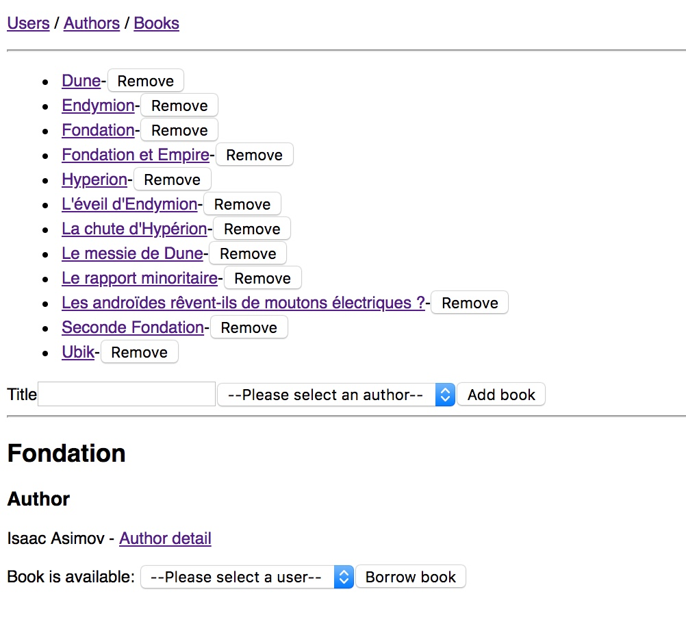
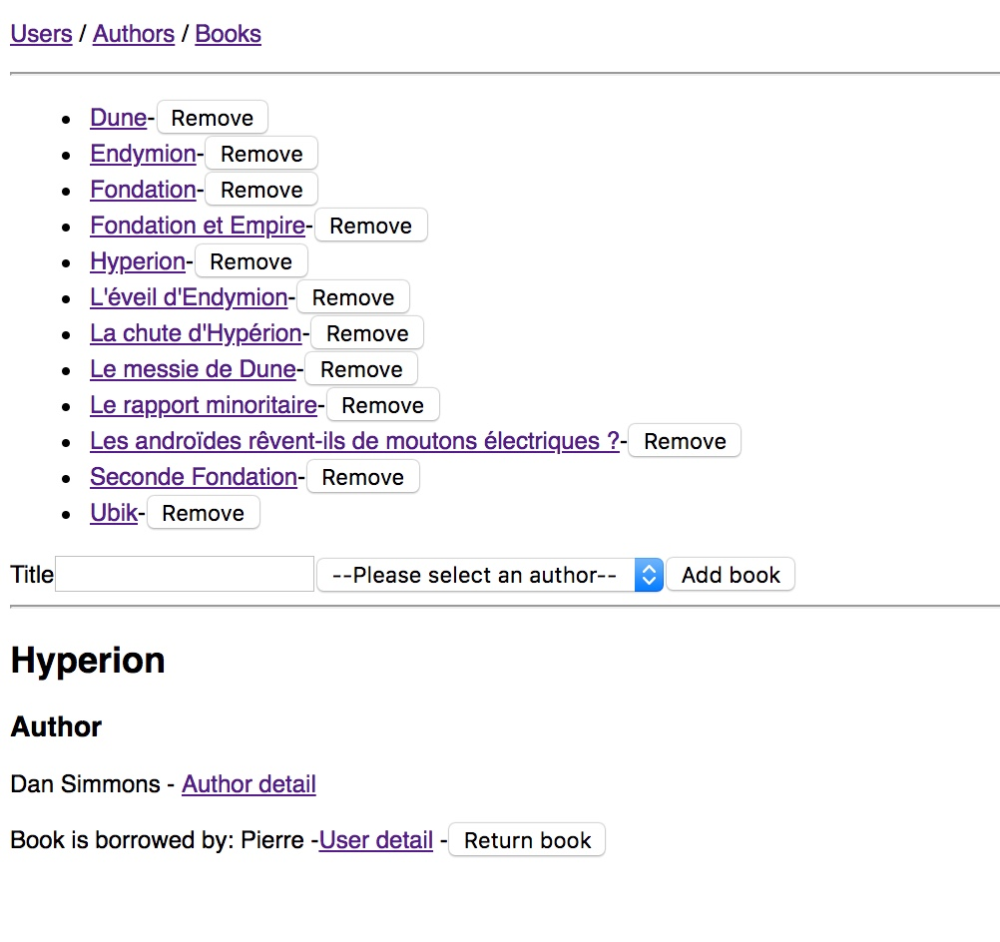

## W4a / W4b - TP noté

Vous allez écrire une application web permettant la gestion d'une bibliothèque.
Cette application est composée :
 - d'une API HTTP développée en Node.JS avec Express, en lien avec une base de données MySQL utilisée au travers de l'ORM Sequelize
 - d'un client web développé avec la bibliothèque React

## Modèle de données

Le modèle de données est le suivant :
- `User` : représente un utilisateur
  - `name` : nom de l'utilisateur
- `Author` : représente un auteur
  - `firstname` : prénom de l'auteur
  - `lastname` : nom de l'auteur
- `Book` : représente un livre
  - `title` : titre du livre

Les relations entre ces entités sont les suivantes :
- un `Book` appartient à un `Author`
- un `Author` a plusieurs `Book`
- un `Book` appartient à un `User`
- un `User` a plusieurs `Book`

Le lien d'appartenance entre `Book` et `Author` représente la paternité de l'oeuvre.
Quand un `Author` est supprimé, l'ensemble de ses `Book` doivent l'être également.

Le lien d'appartenance entre `Book` et `User` représente un emprunt.
Un `Book` peut être soit disponible, soit emprunté par un seul `User`.

## API HTTP

L'API HTTP doit permettre les actions suivantes :
 - obtenir l'ensemble des `User`
 - créer un nouveau `User`
 - supprimer un `User` existant
 - obtenir l'ensemble des `Author`
 - créer un nouvel `Author`
 - supprimer un `Author` existant
 - obtenir l'ensemble des `Book`
 - créer un nouvea `Book` (lors de sa création, un `Book` doit appartenir à un `Author`, mais n'appartient à aucun `User`, i.e. il est disponible)
 - supprimer un `Book` existant
 - obtenir l'ensemble des `Book` d'un `Author`
 - obtenir l'ensemble des `Book` d'un `User`
 - modifier le `User` associé à un `Book`

A vous de déterminer les routes HTTP correspondant à chacune des ces fonctionnalités.
Pour développer, vous partirez de l'état actuel du dossier `server/` fourni.
Ce dossier contient déjà les fichiers suivants :
```
-package.json     --> description des dépendances
-server.js        --> programme principal
  |-models/
  |  |-index.js  --> chargement des modèles définis dans le dossier
  |-routes/
  |  |-index.js  --> chargement des routes définies dans le dossier
  |-controllers/
  |  |-...       --> définition des contrôleurs (middlewares)
```

Le programme principal charge l'ensemble des routes définies dans le dossier `routes/` et démarre un serveur HTTP écoutant sur le port 3344 (vous pouvez choisir un autre port si nécessaire).
Ce serveur sert également statiquement le contenu du dossier `../client/public/` qui contient l'application web client développée.
N'oubliez pas de modifier les options de connexion au serveur de base de données dans le fichier `models/index.js`.

## Client web

Le client web doit proposer des interfaces permettant de :
 - gérer les `User` :
   - liste des `User`
   - ajout/suppression d'un `User`
   - détails d'un `User` :
     - affichage de la liste de ses `Book` empruntés, avec pour chaque `Book` un lien permettant de se rendre au détail du `Book`

Exemple:


 - gérer les `Author` :
   - liste des `Author`
   - ajout/suppression d'un `Author`
   - détails d'un `Author` :
     - affichage de la liste des `Book` écrits, avec pour chaque `Book` un lien permettant de se rendre au détail du `Book`

Exemple:


 - gérer les `Book` :
   - liste des `Book`
   - ajout/suppression d'un `Book`
   - détails d'un `Book` :
     - affichage de l'auteur (ainsi que d'un lien permettant de se rendre au détail de l'`Author`)
	 - affichage de l'état (disponible ou emprunté)
	 - si le `Book` est disponible : formulaire permettant de l'associer à un `User`
	 - si le `Book` est emprunté : affichage du `User` (ainsi que d'un lien permettant de se rendre au détail du `User`) et d'un bouton permettant de "rendre" le `Book`

Exemples:



Pour développer, vous partirez de l'état actuel du dossier `client/` fourni.
Ce dossier contient déjà les fichiers suivants :
```
-package.json       --> description des dépendances / scripts
-webpack.config.js  --> configuration webpack
-src
  |-index.html      --> document HTML de base
  |-index.js        --> point d'entrée du programme
  |-components/
  |  |-app.js       --> composant App
  |  |-home.js      --> composant Home
  |-api
  |  |-index.js     --> module exportant des fonctions d'accès à l'API
```

## Améliorations

Si le temps vous le permet, vous pouvez modifier les interfaces afin de présenter non pas des listes complètes dès le chargement, mais un formulaire de recherche et l'affichage du résultat.

Par exemple, pour les `Book` : un champ de recherche par nom avec un bouton de soumission qui déclenche une requête qui permet la récupération puis l'affichage de la liste des `Book` correspondants. Côté serveur, il faut alors une route pour gérer cette requête et retourner la liste des `Book` dont le titre contient la chaîne reçue.
