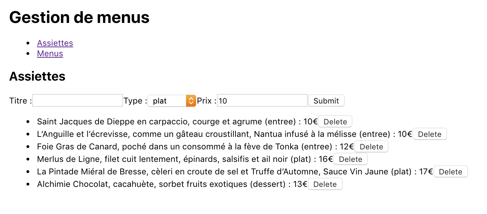
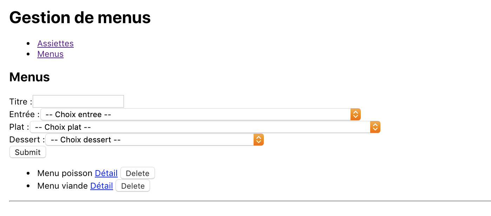
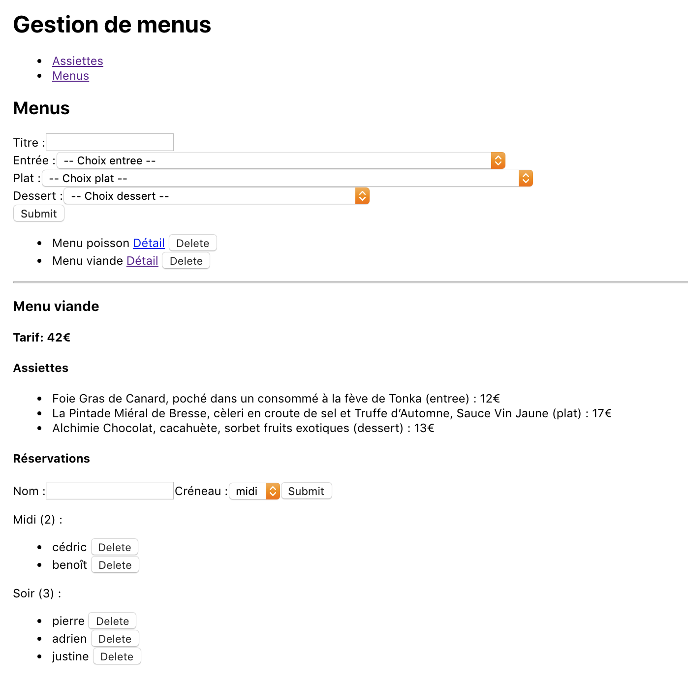

# W4a / W4b - TP noté

Un restaurant organise un événement pour lequel il souhaite proposer des menus spéciaux composés d'assiettes créées pour l'occasion. Afin de pouvoir gérer ses achats et préparations, le restaurant a besoin de prendre les réservations en avance et de connaître le nombre de fois que chaque menu est réservé. Le restaurant assurera ce jour là un service le midi et un autre le soir.

Vous êtes en charge du développement d'une application web permettant la gestion des menus et des réservations.

Cette application est composée :
 - d'une API HTTP développée en __Node.JS__ avec __Express__, en lien avec une base de données MySQL utilisée au travers de l'ORM __Sequelize__
 - d'un client web développé avec la bibliothèque __React__

## Modèle de données

Le modèle de données est le suivant :
- `Assiette` :
  - `titre` : nom de l'assiette
  - `type` : _entree_, _plat_ ou _dessert_
  - `prix` : prix en euros de l'assiette (nombre entier)
- `Menu` :
  - `titre` : intitulé du menu
- `Reservation` :
  - `nom` : nom de la personne
  - `creneau` : _midi_ ou _soir_

Les relations entre ces entités sont les suivantes :
- une `Assiette` peut être dans plusieurs `Menu`
- un `Menu` est composé de plusieurs `Assiette`
- une `Reservation` appartient à un `Menu`
- un `Menu` a plusieurs `Reservation`

La suppression d'un `Menu` entraîne la suppression des `Reservation` associées.

## Client web

Le client web doit proposer des interfaces permettant de :

- gérer les `Assiette`
  - liste des `Assiette`
  - création d'une `Assiette`
  - suppression d'une `Assiette`

- gérer les `Menu`
  - liste des `Menu`
  - création d'un `Menu`
  - suppression d'un `Menu`

*Attention* :
un `Menu` doit être composé de 3 `Assiette` (1 de chaque type (_entree_, _plat_, _dessert_)).
Une `Assiette` peut être utilisée au sein de plusieurs `Menu`.

- détail d'un `Menu` :
  - affichage du coût total du `Menu`
  - affichage de la liste de ses `Assiette`
  - affichage de la liste de ses `Reservation` pour chaque créneau (_midi_ et _soir_)
  - gérer les `Reservation` du `Menu` :
    - liste des `Reservation`
    - création d'une `Reservation`
    - suppression d'une `Reservation`

## Travail demandé

Il vous est demandé de créer l'API HTTP qui permet de manipuler des données correspondant au modèle de données relationnel décrit ci-dessus.
Pour cela, vous devrez notamment définir l'ensemble des routes nécessaires au bon fonctionnement de l'application client.

>__Le code de l'API doit être écrit dans le dossier `server`.__
>__Vous pouvez partir de la structure proposée (celle des TP précédents).__
>__N'oubliez pas de modifier les informations de connexion à la base de données dans le fichier `models/index.js`.__

Vous devez également créer une application client qui permette de réaliser l'ensemble des tâches décrites ci-dessus. Les images d'illustration ne sont qu'indicatives et il ne vous est pas demandé de reproduire ces interfaces à l'identique.

>__Le code de l'application client doit être écrit dans le dossier `client`.__
>__Le plus simple est probablement d'initialiser ce dossier avec la commande `npx create-react-app client`.__

N'oubliez pas que les 2 parties (serveur & client) sont évaluées séparément et il vous est donc fortement recommandé d'équilibrer votre temps entre les 2 aspects.

## Exemples d'interface

Gestion des assiettes :

>

Gestion des menus :

>

Détail d'un menu :

>
